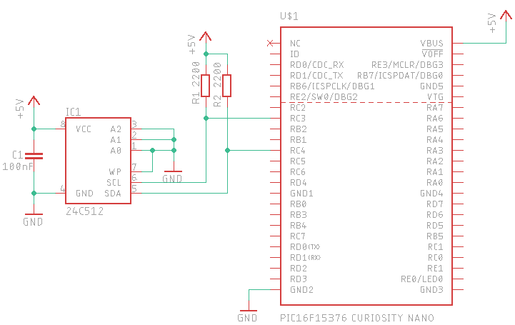

# I2C EEprom demo

### What this example does:
- Communicates with any EEprom with 16bit cell address (from 24C32 to up) using modified I2C libraries generated by MPLAB Code Configurator. Bulk read and write operation supported by specifying the start address. Output on serial port.

### Notes:
- SW0 is used to progress in the demo
- Board is configured for working at 5V
- EEprom is powered through the VBUS pin (5V)
- UART configured at 9600-N-8-1

### System settings:
- system clock: 8MHz

### Connections

| Function     | PIC16F15376 Curiosity Nano pin |
|:-------------|:-------------------------------|
|SCL           |RC3                             |
|SDA           |RC4                             |

### Schematic

### Link
[I2C EEprom usage from MPLAB X](https://www.settorezero.com/wordpress/utilizzare-le-eeprom-i2c-da-un-microcontrollore-pic-con-mplab-x/).
Article is in italian language but there is an automatic translation plugin that will translate the page in your language without your intervention.
