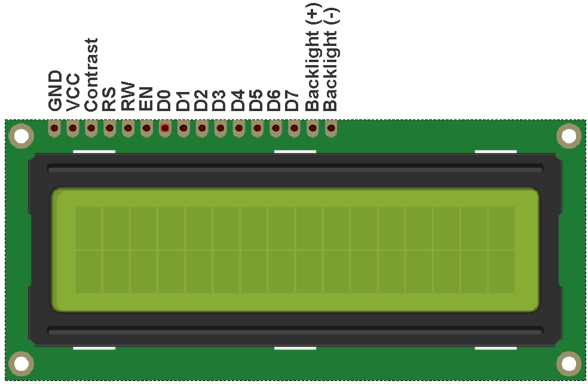

# Alphanumeric LCD (HD44780) Demo

### What this example does:
- Write strings on a HD44780-based Display. The library allows to write signed and unsigned numers up to 16bit, strings, single chars and to personalize 6 chars. For other usage you can see my [previous example for PIC16F18877](https://github.com/Cyb3rn0id/Settorezero_Sources/tree/master/XC/Examples/PIC16F887/C_settorezero_es04_Display_HD44780.X)

### Notes:
- SW0 is not configured
- Is mandatory to power LCD and board using an external power supply. For doing this you must put board VOFF pin to GND and give a 5V supply on VTG pin. IT' DANGEROUS give 5V on VTG without putting VOFF to GND. Please see [repository ReadMe](https://github.com/Cyb3rn0id/Microchip_Curiosity_Nano_Examples#running-at-5-or-33v) paragraph "Running at 3.3 or 5V"
- Example is configured for an 20x4 LCD
- Library is tested on PIC16F15376 Curiosity Nano up to 32MHz, but does not work @32MHz on other PIC MCUs (such as the PIC16F18877)

### System settings:
- system clock: 32MHz

### Connections
Please note: DATA and RS must be on the same port bank! In the example are connected to D bank. Enable and Read/write can be on different port banks. Remember this if you want to change ports

| LCD pin | PIC16F15376 Curiosity Nano pin |
|:--------|:-------------------------------|
|RS       |RD3                             |
|RW       |RB5                             |
|EN       |RC0                             |
|D4 to D7 |RD4 to RD7                      |

### Display Pinout

