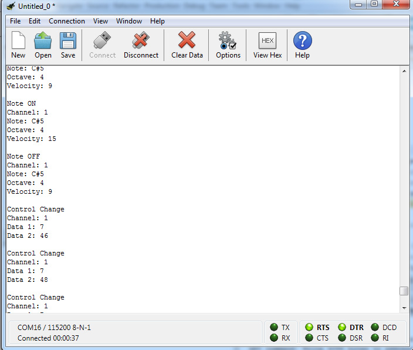

# MIDI RX demo

*WARNING: USING THIS PROJECT V TARGET WILL BE SET TO 5V*   

### What this example does:
- Reads incoming MIDI messages on RB5 (Required a MIDI to TTL Adapter)- used EUSART1
- Parse the MIDI messages and output sentences on USB CDC (115200,N,8,1) - used EUSART 2
- LED0 flashes every time a MIDI message is received on UART
- Outputs a 1MHz square wave on RA0

### Notes:
- SW0 is configured but not used  
- 1mS interrupt on Timer0 triggered but not used
- One day you'll know how I put a 1MHz square wave output
- Is necessary set VTarget at 5V since some midi interfaces send signals at 5V and PIC port can be damaged if works at 3.3V, so in the project properties the VTG is set to 5V, for further information see [repository ReadMe](https://github.com/Cyb3rn0id/Microchip_Curiosity_Nano_Examples#running-at-5-or-33v) paragraph "Running at 3.3 or 5V"

*First than connect a MIDI interface, please verify there are 5V on VTG pin after programming*   
>remember that 5V setting is *permanent*, so if you want to set the board to 3.3V again, you must change the project property

### EUSART1 settings:
- Baudrate: 31250 (inserted manually)
- Receive enabled, Transmit NOT enabled
- Interrupts enabled
- NO redirect STDIO to USART

### EUSART2 settings:  
- Baudrate: 115200
- Transmit enabled, Receive NOT enabled
- NO interrupts
- Redirect STDIO to USART

### Other settings:
- RB5 locked on EUSART1-RX1 (output)  (midi RX)
- RD0 locked on EUSART2-TX2 (input)   (CDC TX)
- RA0 locked on NCO1-NCO (output)     (1MHz square wave)
- RE2 locked on GPIO input            (button SW0)
- RE0 locked on GPIO output           (led LED0)
- System clock: 16MHz

Example output on a Serial terminal:  

