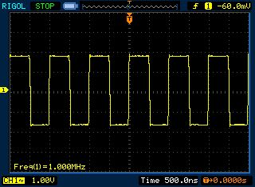

# Numerically Controlled Oscillator Demo

### What this example does:
- 1MHz Square wave out on RD0 (50% fixed Duty Cycle)
- LED0 flashing every 500mS on interrupt

This example shows how to use NCO. For further informations see [NCO example for PIC16F18446](../16F18446_Curiosity_Nano_Test_NCO.X/)

### NCO1 Settings:
- Enable NCO
- NCO mode: FDC mode
- Clock Source: FOSC (16MHz)
- NCO output frequency: 1MHz (actually precise)

Timer0 is only used for flashing a led (NCO is an indipendent peripheral and does not requires a timer or CPU)

### Timer 0 settings:  
- Enable Timer
- Clock Source: FOSC/4
- Prescaler: 1:1
- Post Scaler: 1:1
- Timer mode: 16bit
- Requested period: 1mS

Other settings:
- RD0 locked on NCO1-NCO output in the Pin Manager grid
- RE2 locked as GPIO input in the Pin Manager grid (SW0 with pull-up enabled) - Not used in this example
- RE0 locked as GPIO output in the Pin Manager grid (LED0 - starts high=led off)
- System clock: 16MHz

Oscilloscope image:  
 
