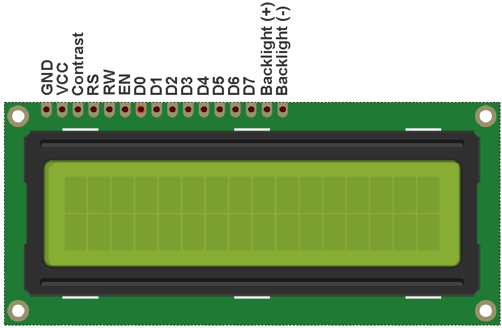

# Square Wave generator

### What this example does:
- Generates square waves with 50% Duty Cycle from 1Hz to 16MHz with 1Hz step using the NCO (Numerically Controlled Oscillator) in FDC (Fixed Duty Cycle) mode. Here is a picture on my [Twitter](https://twitter.com/settorezero/status/1215222093505351680)

### Notes:
- SW0 is used for changing frequency step per encoder tick
- An encoder is used: encoder pins, A & B, are connected to RC2 and RC3: turning the encoder, frequency will increment/decrement by the value set by SW0
- The encoder button is used. Button is connected between GND and RC4. Pushing the encoder button will toggle between Medium Frequency oscillator (31250Hz) and FOSC (32MHz) as clock source for the NCO module. MF is better for lower frequencies (you can obtain 1Hz and above), FOSC is used for higher frequencies above 15KHz
- Is mandatory to power LCD and board using an external power supply. For doing this you must put board VOFF pin to GND and give a 5V supply on VTG pin. IT' DANGEROUS give 5V on VTG without putting VOFF to GND. Please see [repository ReadMe](https://github.com/Cyb3rn0id/Microchip_Curiosity_Nano_Examples#running-at-5-or-33v) paragraph "Running at 3.3 or 5V"
- Example is configured for an 16x2 LCD
- Above 10MHz square waves appears weird on the oscilloscope... but works
- NCO output on RD2

### System settings:
- system clock: 32MHz
- Interrupt on Timer0 every 1mS
- Interrupt on RC2 and RC3 for any state change

### Connections
Please note: LCD DATA and RS must be on the same port bank! In the example are connected to D bank. Enable and Read/write can be on different port banks. Remember this if you want to change ports

| Component    | PIC16F15376 Curiosity Nano pin |
|:-------------|:-------------------------------|
|LCD RS        |RD3                             |
|LCD RW        |RB5                             |
|LCD EN        |RC0                             |
|LCD D4 to D7  |RD4 to RD7                      |
|ENCODER A     |RC2                             |
|ENCODER B     |RC3                             |
|ENCODER BUTTON|RC4                             |
|SW0           |RE2 (default on nano board)     |
|OUTPUT        |RD2                             |

### Display Pinout

