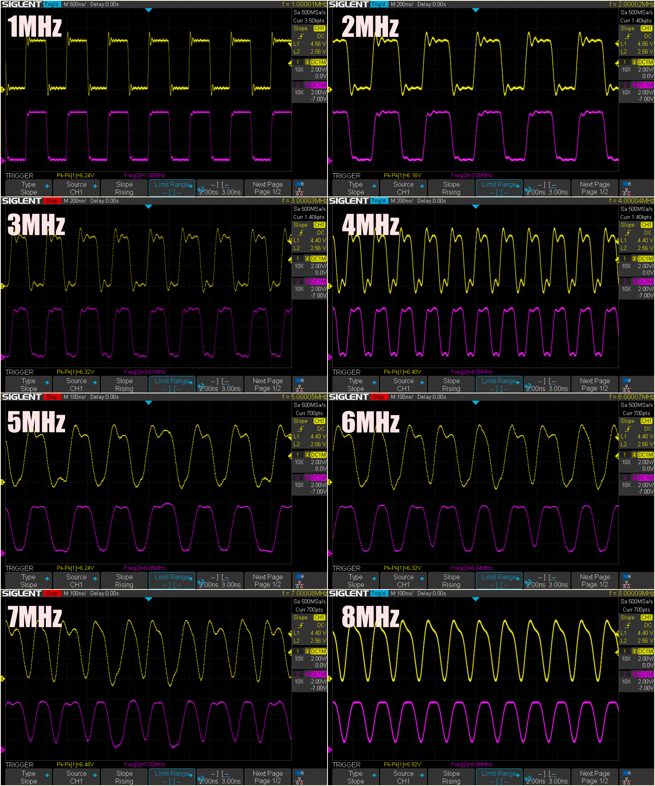
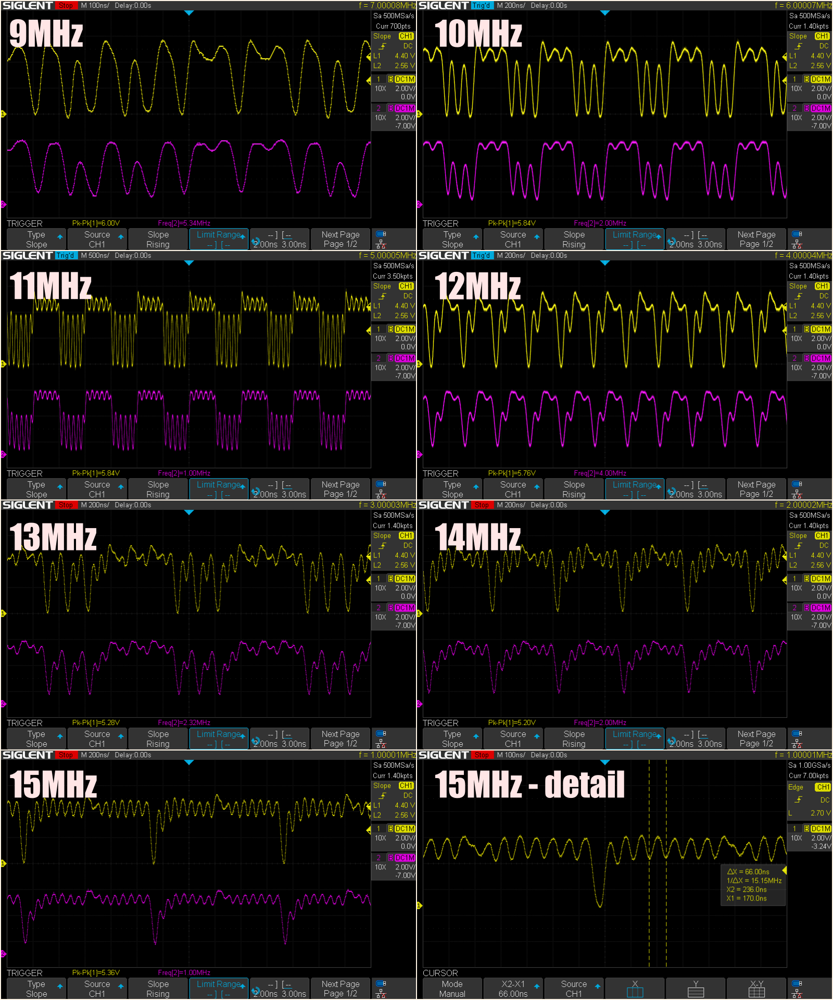
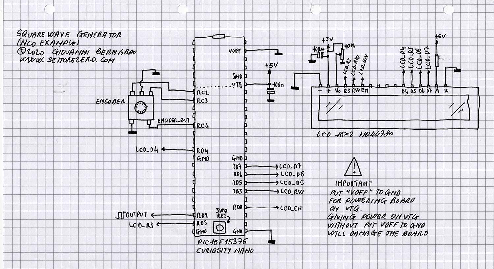
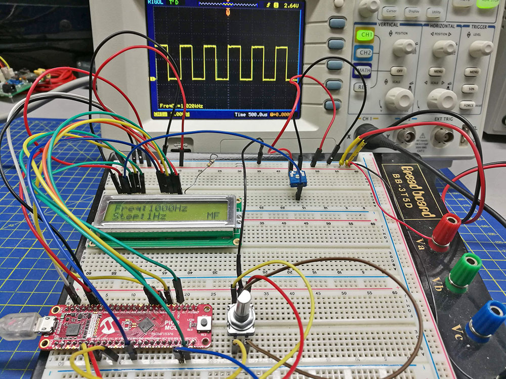

# Square Wave generator

### What this example does:
- Generates square waves with 50% Duty Cycle from 1Hz to 16MHz(*) with 1Hz step using the NCO (Numerically Controlled Oscillator) in FDC (Fixed Duty Cycle) mode. Here is a picture on my [Twitter](https://twitter.com/settorezero/status/1215222093505351680)

_(*) In reality this frequency appears not to be useable, see next paragraphs_

### Notes:
- SW0 is used for changing frequency step per encoder tick
- A rotary encoder is used: encoder pins, A & B, are connected to _RC2_ and _RC3_: turning the encoder, frequency will increment/decrement by the value set by _SW0_
- The encoder button is used. Button is connected between GND and _RC4_. Pushing the encoder button will toggle between Medium Frequency oscillator at 31.25kHz (MFINTOSC 31250Hz) and FOSC (HFINTOSC 32MHz) as clock source for the NCO module. MFINTOSC is better for lower frequencies (you can obtain 1Hz and above, but also lesser than 1Hz if you make modifications to code), HFINTOSC is used for higher frequencies above 15KHz
- Is mandatory to power LCD and board using an external power supply. For doing this you must put board VOFF pin to GND and give a 5V supply on VTG pin. IT' DANGEROUS give 5V on VTG without putting VOFF to GND. Please see [repository ReadMe](https://github.com/Cyb3rn0id/Microchip_Curiosity_Nano_Examples#running-at-5-or-33v) paragraph "Running at 3.3 or 5V"
- Example is configured for an 16x2 LCD
- Above 8MHz square waves appears weird on the oscilloscope (see next paragraph)
- NCO output on _RD2_

### About Square waves on the output
In order to minimize the overshoot due to impedance between IO and subsequent system (e.g.: the oscilloscope for checking the signal) is better to place a resistor in series (I used 1kohm).
Up to 1MHz square wave is good. From above 1MHz to 8MHz square wave starts to have a weird shape tending to looks like a sinusoidal wave. See next picture (yellow signal is the output straight from the pin, purple signal is the output after 1kohm resistor):  

By passing 8MHz, signal becomes instable and pretty unuseable: oscilloscope can't read the real frequency but zooming on the signal the frequency can be read (see last frame):  

This is probably due to the fact that instructions on the microcontroller are not executed at the selected FOSC (32MHz) but at FOSC/4 (8MHz), so probably 8MHz is the real limit for the output since instructions will be executed at this rate.   
  
I can add further details about my experiments:
- I tried also to use the bare PIC16F15376 on a perfboard (instead of the curiosity nano board), so with soldered wires, ground planes and external oscillator (8MHz crystal with 4x PLL enabled), but output is identical, nothing changes
- I tried to use other settings for the internal oscillator, but output is always identical, nothing changes
- Oscilloscope used is a 200MHz one, so I think don't have problems reading 15MHz

I didn't tried to use the NCO output as internal signal: maybe high frequencies are useable for internal purposes but not on the pin output...  

Additionally, according datasheet, maximum frequency from the NCO can be 32MHz using the Pulse Frequency Mode: in the reality there is no possibility to go above 16MHz on the output: signals will be always the same shape and above 16MHz there is nothing on the output.

### System settings:
- system clock: 32MHz
- Interrupt on Timer0 every 1mS
- Interrupt on RC2 and RC3 for any state change

### Connections
Please note: LCD DATA and RS must be on the same port bank! In the example are connected to D bank. Enable and Read/write can be on different port banks. Remember this if you want to change ports

| Component    | PIC16F15376 Curiosity Nano pin |
|:-------------|:-------------------------------|
|LCD RS        |RD3                             |
|LCD RW        |RB5                             |
|LCD EN        |RC0                             |
|LCD D4 to D7  |RD4 to RD7                      |
|ENCODER A     |RC2                             |
|ENCODER B     |RC3                             |
|ENCODER BUTTON|RC4                             |
|SW0           |RE2 (default on nano board)     |
|OUTPUT        |RD2                             |

### Display Pinout

### Schematic

### Links
- [Article on my blog](https://www.settorezero.com/wordpress/un-generatore-di-onda-quadra-da-1hz-a-16mhz-con-un-microcontrollore-pic/)

### Pictures

