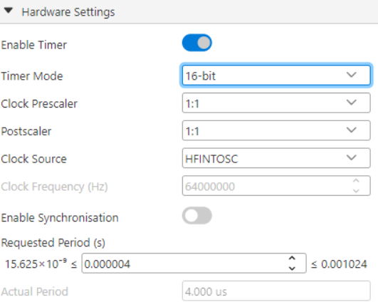
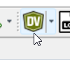
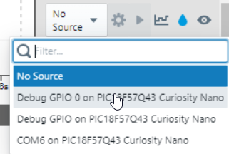
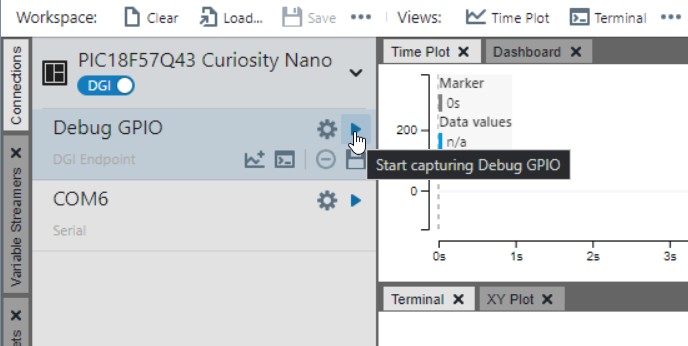
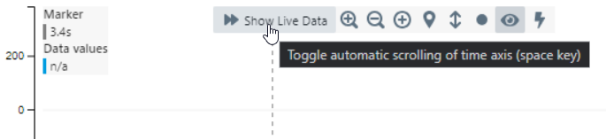

# Blinking led on Timer0 Interrupt with debug

### What this example does:
- The on-board LED (connected on RF3) toggles every 500mS (1Hz flash rate) using the overflow interrupt on Timer0
- The debug pin (aka GPIO0 aka DBG2 aka RB4) will toggle too allowing the user to visualize the event on the "Data Visualizer" component of MPLAB X

### Notes:
- The onboard witch, SW0, is connected on the same IO used as debug pin, so pay attention when you use this switch but you want also to use this debug feature
- The Timer0 interrupt is actually set to fire every 4uS: even if from the Timer0 Hardware settings is possible to go under to 15.625x10^-9 seconds (15.626nS), in the reality I can't go uder 4uS: even if I put 1uS, interrupt fires every 4uS...  

I posted this question on the [Microchip Forum](https://forum.microchip.com/s/topic/a5CV40000002KYvMAM/t398385)

### Settings:
- External oscillator: not enabled
- Oscillator used: HFINTOSC at 64MHz
- Interrupt manager set to use High and Low priorities
- Timer0 set as High Priority Interrupt
- RB4 set as output to be used as debug pin 

### How to use Data Visualizer
- You must set RB4 as output. Remember that RB4, from the Debug side is known as GPIO0
- After you uploaded code on the board, start the "Data Visualizer" by pressing the "DV" icon:  

- In the data visualizer, set GPIO0 in the "Data Axis" settings:  

- Press the "Play" button next to the "Debug GPIO" feature:  

- If you don't see any signal on the plot, maybe the plot is paused, click "Show Live Data" in the plot:  

