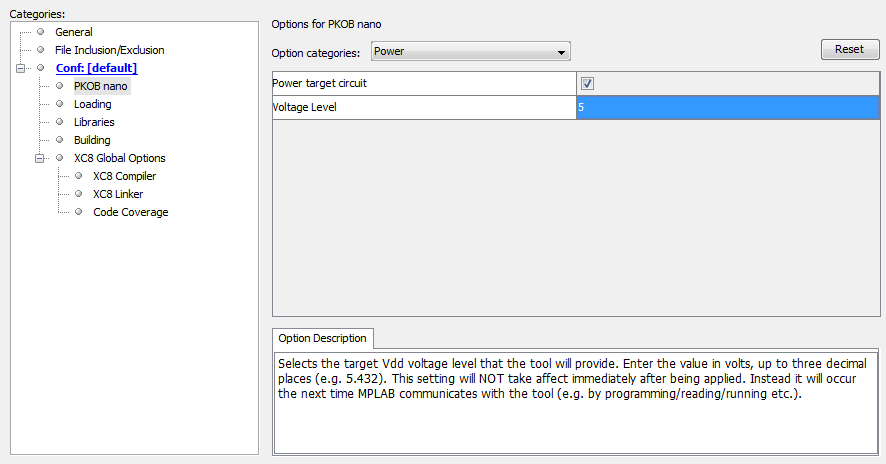
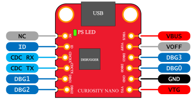

# Microchip Curiosity Nano Examples   

My experiments, snippets and documents about Microchip Curiosity Nano boards I use for my projects.

### Powering Curiosity Nano 
#### Running at 5 or 3.3V 
By default Curiosity nano runs at 3.3V when powered from USB: there is a software controlled variable regulator on board that generates the VTG (V Target). If you want to run the board @5V when you power it from USB you must change a parameter in the project configuration:  

- Right click on project in "Projects" tree and select "Properties"
- in "Categories" box on the left, select "PKOB Nano"
- in "Option Categories" dropdown box, on the right, select "Power"
- check the "Power target circuit" checkbox
- write "5" in the blank field "Voltage level"
- press OK   

The project property will be changed and will be active the next time you'll program the board. Voltage change is permanent, so there is no need to keep this setting every-time for every project: be careful. This setting, obviously, only affect the V Target when you power the board from USB. Following picture illustrates where this setting is located:   

  

#### Powering from external 
If you want to power the board from the external instead of USB, you must tie to GND the pin "VOFF": it's the second pin on the right, starting from top, having the USB connector on top: this will disable the on board regulator. After you've tied VOFF to GND you can power the board on the pin "VTG": it's the sixth pin on the right, starting from top, having the USB connector on top. The voltage you apply will not be affected by the modification explained above. 5V is the maximum.   

   

*WARNING*: if you use the old PIC16F18446 revision (Called 'MPLAB Xpress PIC16F18446') there is no "VOFF" pin (the debug header has fewer pins) and you must cut some traces below the board for powering from external, please refer to old documents in \assets\ folder

### Usage of certain pins  
Following infos are for the PIC16F15376 Curiosity Nano.  
- RCO and RC1: Normally, those pins are not routed from edge connector to PIC MCU, so if you would to use them, put a solder blob on pads on the bottom of the board marked as RC0 - RC1. They're not connected since you can choose to use them for the Secondary Oscillator (SOSC)soldering a 32768Hz Crystal on top.
- RB6 and RB7: Those pins are not shown on the silkscreen. They are used by the debugger (DBG1/ICSPCLK and DBG0/ICSPDAT respectively), maybe is safe to use if you disconnect them first than programming
- RD0 and RD1: are shared with USB CDC and used by debugger, they appears on the silkscreen. Advice is to them as UART TX (RD0) and RX (RD1) using EUSART2, change EUSART2 pins in the configurator
- RE0: is connected to LED anode (pin low = led ON).
- RE2: is connected to DGB2 Debugger pin and shared with SW0. "RE2" marking does not appear on silkscreen
- RE3: this pin is MCLR and is connected with DBG3 debugger pin.  "RE3" marking does not appear on silkscreen

### Links
- My Simple (italian) [tutorial about Curiosity Nano and MPLAB Code Configurator](https://www.settorezero.com/wordpress/curiosity-nano-code-configurator-per-entrare-nel-mondo-dei-microcontrollori-pic-senza-sforzo-e-in-economia/)
- [Microchip Curiosity Nano Portfolio](https://www.microchip.com/design-centers/8-bit/development-tools/pic-hardware/curiosity-nano-development-platform)
